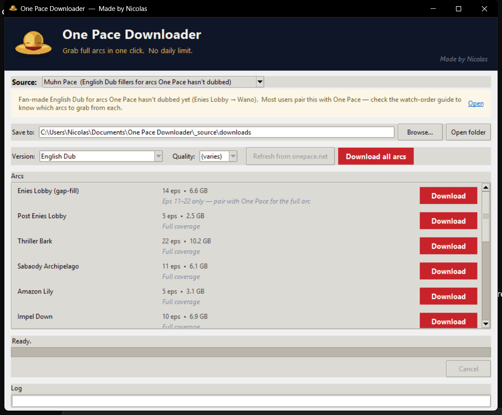

# One Pace Downloader

Small Windows app I built for grabbing [One Pace](https://onepace.net) arcs. Click an arc, pick a quality, it dumps everything to a folder. Now also handles [Muhn Pace](https://www.reddit.com/r/onepace/comments/1rtpukk/one_pace_dub_watch_guide/) for arcs One Pace hasn't dubbed yet.

> Switch the **Source** dropdown to *Muhn Pace* for fan-made dub fillers (Enies Lobby → Wano):
>
> 

## Download

Latest .exe → **[Releases page](https://github.com/Nicolaslahri/onepace/releases/latest)**

Double-click and you're in. Nothing to install.

## Why I made this

Downloading arcs from onepace.net is a pain. Every arc is split across a pile of separate links, and there's a daily limit that turns long arcs like Wano into a multi-day project. This just gets them in one go.

## Two sources, one app

- **One Pace** *(default)* — main fan re-cut. Sub for every arc Romance Dawn → Egghead, Dub for the newer arcs. Most users start here.
- **Muhn Pace** — fan-made English dub fillers covering arcs One Pace hasn't dubbed yet (Enies Lobby through Wano). Pair this with One Pace if you're watching dubbed. The full watch order is in [u/KPGNL's dub guide](https://www.reddit.com/r/onepace/comments/1rtpukk/one_pace_dub_watch_guide/) — the app links to it.

Both sources download through the same pipeline. Pick a folder once, switch sources from the dropdown, click Download. The app shows you which episodes each Muhn Pace album covers (e.g. *"Eps 11–22 only — pair with One Pace for the full arc"*) so you don't end up with a hole in your watch order.

## Using it

1. Open the .exe.
2. Pick a folder (or use the default `downloads/` next to the .exe).
3. Pick the version (Sub / Dub / Dub-CC) and quality (1080p / 720p / 480p) at the top.
4. Hit **Download** on whichever arc you want, or **Download all arcs** to queue everything.

If you close it mid-download, the next launch picks up where it stopped. Already-finished episodes are skipped.

## Heads up

- Windows only for now.
- First time you run it, SmartScreen will throw a warning. The .exe isn't signed (signing certs are expensive). Click **More info → Run anyway**, or right-click the .exe → Properties → tick **Unblock**.
- When new arcs drop on onepace.net, hit the **Refresh** button in the app and they show up.

## Is it safe?

Fair question. Verify yourself — every claim below links out.

**SHA256:** `3fd42c1fe6186f1792e8d70b52f41fff8b6317ddb762bae4e61592bf42afc845`

The clean engines include **Bitdefender, ESET, Sophos, Symantec, Avast, AVG, Malwarebytes, TrendMicro, Avira, F-Secure, Webroot, Emsisoft, GData, DrWeb** and 50+ others. The 6 flags are heuristic / AI scanners (Cylance, Bkav, CrowdStrike Falcon Static AI, SentinelOne Static AI, APEX) plus, on this build, **Microsoft Defender's cloud ML model** — flagged as `Trojan:Win32/Wacatac.B!ml`. The `!ml` suffix means it's a machine-learning guess, not a signature match. Wacatac is one of the most common false-positive labels Defender's cloud throws at unsigned solo-dev tools; running the same .exe through local `MpCmdRun -Scan` returns clean.

I've submitted the file to Microsoft as a false positive — they usually whitelist within ~3 days. If Windows quarantines the .exe in the meantime, you can either:
1. Right-click → **Allow on device** in the Defender notification, or
2. Open Windows Security → Virus & threat protection → Manage settings → add `OnePaceDownloader.exe` to **Exclusions**.

If you don't trust the badge, click through to the [full VirusTotal report](https://www.virustotal.com/gui/file/3fd42c1fe6186f1792e8d70b52f41fff8b6317ddb762bae4e61592bf42afc845) or drop the .exe onto [virustotal.com](https://www.virustotal.com) yourself.

## Found a bug / want to chat

Discord is the fastest: **[discord.gg/JvaCyYbbSk](https://discord.gg/JvaCyYbbSk)**

Or open an [issue](https://github.com/Nicolaslahri/onepace/issues) here. Reddit's [u/nicolasenjah](https://www.reddit.com/user/nicolasenjah/) too.

— Nicolas
