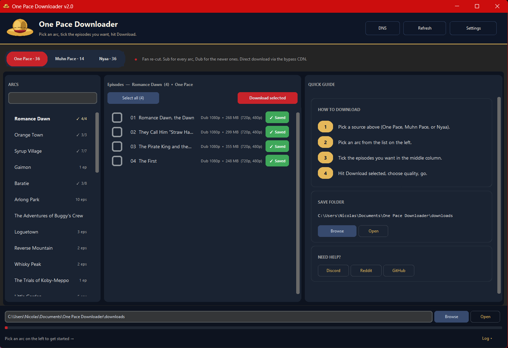
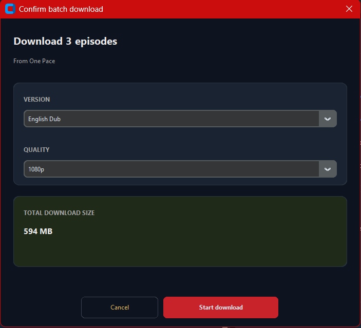
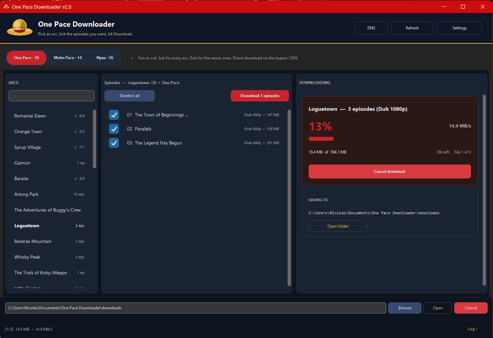
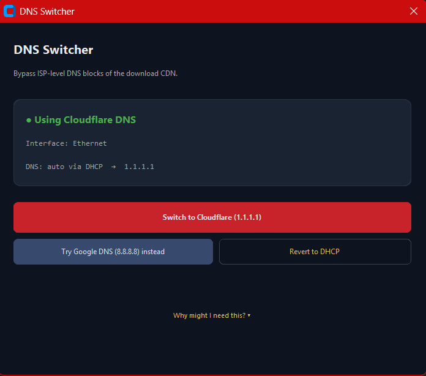

<div align="center">


# One Pace Downloader

**Grab every One Pace arc in one click — Sub, Dub, torrents, or Usenet.**

[](https://discord.gg/KHn6AbevZ2)
[](https://www.reddit.com/user/nicolasenjah/)
[](LICENSE)

<br />

<a href="https://github.com/Nicolaslahri/onepacedownloader/releases/latest">
  
</a>

<br /><br />



</div>

---

## Why?

Downloading arcs from onepace.net by hand is a pain — every arc is split across separate links with a daily limit that turns long arcs like Wano into a multi-day project. This grabs them in one go.

> Double-click the `.exe` and you're in. Nothing to install.
> Source is in [`_source/`](_source/onepace_downloader.py) under MIT if you'd rather read or run it yourself.

---

## Features

| | Source | What it is |
|---|---|---|
| **One Pace** *(default)* | Pixeldrain | Main fan re-cut. Sub for every arc Romance Dawn &rarr; Egghead, Dub for newer arcs. Most users start here. |
| **Muhn Pace** | Pixeldrain | Fan-made English dub fillers for arcs One Pace hasn't dubbed (Enies Lobby &rarr; Wano). Pair with One Pace for a full dub watch. [Watch order guide](https://www.reddit.com/r/onepace/comments/1rtpukk/one_pace_dub_watch_guide/). |
| **Nyaa** | Torrents | Torrents from [nyaa.si](https://nyaa.si/?q=one+pace), grouped by arc. Hands the magnet to your torrent client. Great when pixeldrain is throttled or you want to seed back. |
| **Usenet** | NZB | NZB files for One Pace releases via NZBGeek. For users with an existing SABnzbd / NZBGet setup. |

**Plus:**

- **Plex / Jellyfin auto-organize** &mdash; files renamed into `One Pace/Season N/One Pace - sNNeNN - Title.ext` with `.nfo` metadata, ready for your media server
- **Resume downloads** &mdash; close mid-download, next launch picks up where it stopped
- **Saved tracking** &mdash; green **Saved** chips per episode, per-arc progress counts (`12/35`)
- **Built-in DNS fix** &mdash; one-click Cloudflare/Google DNS switcher for ISPs that block the CDN

---

## Quick Start

<table>
<tr>
<td width="50%">

**1.** Open the `.exe`
**2.** Pick a save folder (or keep the default)
**3.** Click an arc &rarr; tick episodes &rarr; **Download selected**
**4.** Confirm version (Sub / Dub / Dub-CC) and quality (1080p / 720p / 480p)

</td>
<td width="50%">



</td>
</tr>
</table>

Total size shown up front so you know what you're committing to. The right column turns into a live status panel while downloading:

<div align="center">

</div>

---

## Plex / Jellyfin Setup

Open **Settings &rarr; Output organization** and tick **Organize for Plex / Jellyfin**.

Every download is automatically renamed and sorted:

```
downloads/
  One Pace/
    Season 14/
      One Pace - s14e01 - Sir Crocodile, the Pirate.mkv
      One Pace - s14e01 - Sir Crocodile, the Pirate.nfo
      ...
```

Each `.nfo` carries the real episode title and plot from [SpykerNZ/one-pace-for-plex](https://github.com/SpykerNZ/one-pace-for-plex), so Plex and Jellyfin recognize the show and pull artwork automatically.

> **Tip:** Already downloaded files before enabling the toggle? No problem &mdash; saving the setting retroactively organizes everything in your save folder.

---

## Usenet Setup

<details>
<summary><b>Click to expand</b> &mdash; only needed if you have a Usenet subscription</summary>

<br />

Skip this if you don't use Usenet &mdash; Pixeldrain (One Pace) and Nyaa (torrents) work for everyone.

### What you need

1. A **Usenet provider** subscription (~$10/mo) &mdash; [Newshosting](https://www.newshosting.com/), [Eweka](https://www.eweka.nl/), or [UsenetServer](https://www.usenetserver.com/)
2. **[SABnzbd](https://sabnzbd.org/)** (free) or NZBGet installed and configured with your provider
3. An **[NZBGeek](https://nzbgeek.info/)** account + API key &mdash; the bundled release IDs are NZBGeek-specific

### In the app

1. **Settings** &rarr; scroll to the **Usenet** card
2. Paste `https://api.nzbgeek.info` into *Indexer URL* (it's the default)
3. Paste your NZBGeek API key (*[find it here](https://nzbgeek.info/dashboard.php?myaccount)*)
4. **Save & close**

Then switch the source dropdown to **Usenet**, pick an arc, tick episodes, and hit **Download selected**.

### Good to know

- Your API key never leaves your machine &mdash; it lives in `config.json` next to the `.exe`
- Coverage isn't complete &mdash; some arcs (Alabasta, Thriller Bark, Gaimon) aren't on NZBGeek. The app shows what's available
- Older releases (pre-2021) may have rotated off your provider's retention

</details>

---

## Downloads Not Starting?

Some ISPs block the CDN &mdash; the app opens but downloads never begin.

<details>
<summary><b>Two-minute fix &mdash; switch Windows DNS to Cloudflare</b></summary>

<br />

**Manual:** Settings &rarr; Network & Internet &rarr; your connection &rarr; DNS server assignment &rarr; **Edit** &rarr; Manual &rarr; IPv4 on &rarr; Preferred `1.1.1.1`, Alternate `1.0.0.1` &rarr; Save.

**Or use the built-in DNS switcher:** top-right corner &rarr; **DNS** &rarr; pick Cloudflare or Google. UAC prompt, done. Revert from the same panel.

<div align="center">

</div>

Set-and-forget alternative: [Cloudflare WARP](https://1.1.1.1/). Last resort, any VPN works.

If none of those help, paste the Log panel contents into [Discord](https://discord.gg/KHn6AbevZ2).

</details>

---

## Is It Safe?

Fair question. Verify yourself.

<div align="center">

**SHA256:** `f3ac31a905a7a01caafb3c42119f64453e0da49c42a80e2add8e91d7fe5c0853`

[](https://www.virustotal.com/gui/file/f3ac31a905a7a01caafb3c42119f64453e0da49c42a80e2add8e91d7fe5c0853)

</div>

Most engines clean &mdash; Bitdefender, ESET, Sophos, Symantec, Avast, AVG, Malwarebytes, Microsoft Defender all pass. A handful of heuristic scanners (APEX, Bkav, CrowdStrike, Cylance, SentinelOne) sometimes flag PyInstaller `--onefile` builds based on packed-binary patterns rather than actual malicious behavior &mdash; a common false-positive for unsigned solo-dev tools.

> Don't trust the badge? Drop the `.exe` onto [virustotal.com](https://www.virustotal.com) yourself, or read the [full Python source](_source/onepace_downloader.py) &mdash; one file, stdlib only, MIT.

<details>
<summary><b>What if my AV flags <code>cdn.pixeldrain.eu.cc</code> while downloading?</b></summary>

<br />

That's the CDN, not the `.exe`. `pixeldrain.eu.cc` is the no-cap mirror of pixeldrain.com (same files, unofficial host) &mdash; the only way to grab a full arc without hitting the 6 GB/day limit. Some AVs (Bitdefender, Norton) flag the domain on reputation because it has no track record, not because of a payload. Allow the domain in your AV's web protection, or pause web shield during the download.

</details>

---

## Heads Up

- **Windows only** &mdash; single `.exe`, nothing to install
- **SmartScreen warning** on first launch &mdash; the `.exe` isn't signed (certs are expensive). Click **More info &rarr; Run anyway**, or right-click &rarr; Properties &rarr; tick **Unblock**

---

## Credits

This app is just a downloader &mdash; none of the actual content is mine. Huge thanks to:

| | |
|---|---|
| **[One Pace team](https://onepace.net)** | Ten-plus years of re-cutting One Piece into the version everyone wishes Toei would air. Every Sub episode comes from their releases. |
| **Muhny** | Editing Muhn Pace &mdash; the dub fillers covering Enies Lobby &rarr; Wano. ~184 GB of careful audio work that's saved dub watchers months of waiting. |
| **[u/KPGNL](https://www.reddit.com/user/KPGNL/)** | Maintaining the [dub watch-order guide](https://www.reddit.com/r/onepace/comments/1rtpukk/one_pace_dub_watch_guide/) the app links to. Original version by **u/AlternativeAd1098**. |
| **[SpykerNZ](https://github.com/SpykerNZ/one-pace-for-plex)** | Canonical episode titles, plots, and the Plex/Jellyfin season layout used by the *Organize for media server* option. |

If you find One Pace or Muhn Pace useful, drop them a thank-you wherever they hang out &mdash; that's worth more than anything I could do.

---

<div align="center">

### Found a bug? Want to chat?

Discord is fastest: **[discord.gg/KHn6AbevZ2](https://discord.gg/KHn6AbevZ2)**

Or open an [issue](https://github.com/Nicolaslahri/onepacedownloader/issues) &middot; ping [u/nicolasenjah](https://www.reddit.com/user/nicolasenjah/) on Reddit

<br />

*Made with care by Nicolas*

</div>
