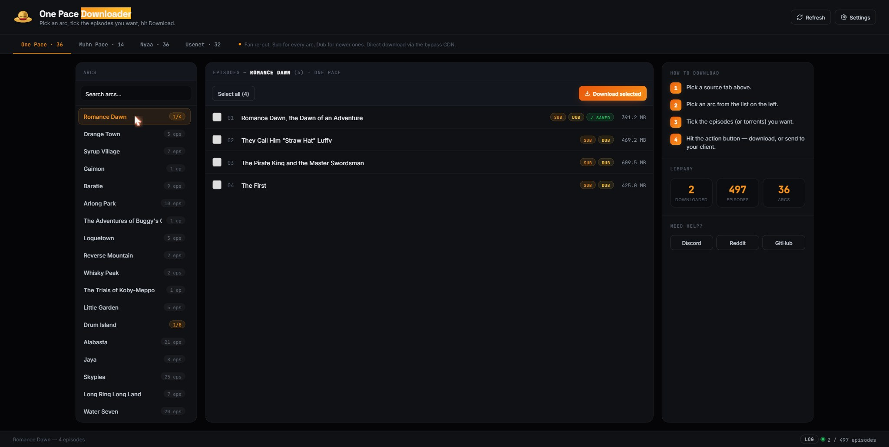

# One Pace Downloader — Docker

A self-hosted web version of One Pace Downloader for your home server. Runs
in the browser, downloads arcs straight into your Plex / Jellyfin library,
and hands Usenet / torrent jobs off to SABnzbd / qBittorrent.

<p align="center">
  
</p>

**What's inside:**

- 🎬 **Direct downloads** from One Pace / Muhn Pace, auto-organized into `One Pace/Season N/` with `.nfo` so Plex and Jellyfin pick it up automatically.
- 🔌 **Send-to-client integration** with **SABnzbd** (Usenet) and **qBittorrent** (torrents) via their APIs.
- 📊 **Live progress** for all three sources in one panel — with cancel, ETA, source tags, and a collapsible log.
- ✅ **Saved tracking** — green chip on every episode already on disk, plus per-arc `N/M` progress badges.
- 🔔 **Update notifications** — a pill in the header when a newer image is published.
- 🔐 **PUID/PGID** file ownership (linuxserver.io pattern) + settings persistence across updates.

Web UI runs on port **7654**.

---

## Install — one command

You need [Docker](https://docs.docker.com/get-docker/). Then:

```bash
docker run -d \
  --name onepace-downloader \
  -p 7654:7654 \
  -e PUID=1000 -e PGID=1000 \
  -v /path/to/your/media:/media \
  -v onepace-config:/config \
  ghcr.io/nicolaslahri/onepacedownloader:latest
```

Change `/path/to/your/media` to your Plex / Jellyfin library folder, then
open **http://localhost:7654** (or `http://YOUR-SERVER-IP:7654`).

`PUID` / `PGID` should match the owner of your media folder — run `id` on
the host to find yours. Files end up owned by that user instead of root.

That's it — the image is pre-built, nothing to compile.

---

## Install — Docker Compose

Compose keeps your settings tidy and makes updates one command. Grab
[`docker-compose.yml`](docker-compose.yml) from this folder, edit the media
path, then:

```bash
docker compose up -d
```

To update later:

```bash
docker compose pull && docker compose up -d
```

---

## Install — Portainer

If you manage Docker through [Portainer](https://www.portainer.io/):

1. **Stacks** → **Add stack**
2. **Name:** `onepace-downloader`
3. **Build method:** *Web editor* — paste this in:

   ```yaml
   services:
     onepace:
       image: ghcr.io/nicolaslahri/onepacedownloader:latest
       container_name: onepace-downloader
       restart: unless-stopped
       environment:
         - PUID=1000
         - PGID=1000
       ports:
         - "7654:7654"
       volumes:
         - onepace-config:/config
         - /path/to/your/media:/media

   volumes:
     onepace-config:
   ```

4. Change `/path/to/your/media` to your Plex / Jellyfin library path.
5. Set `PUID` / `PGID` to the owner of that folder (run `id` on the host).
6. Click **Deploy the stack**.

Open `http://YOUR-SERVER-IP:7654` when it's up. To update later, open the
stack and hit **Pull and redeploy**.

> If the image won't pull, the package may still be private — see the
> *Maintainer note* below.

---

## Volumes

| Path | What it holds |
|------|---------------|
| `/media` | Your Plex / Jellyfin library. One Pace / Muhn Pace downloads land here, auto-organized into `One Pace/Season N/`. Must be writable by your `PUID`/`PGID`. |
| `/config` | Persistent settings + the cached episode index. Keep this so your config survives updates. The container makes it writable on startup. |

## Changing the port

The container listens on **7654**. To use a different port on your
machine, change only the left side of the mapping — e.g. `-p 9000:7654`
(or `"9000:7654"` in Compose / Portainer).

## Settings

Open the **Settings** panel in the web UI to set your default version /
quality and connect SABnzbd, qBittorrent, and NZBGeek. You can also
pre-seed these via environment variables — see the commented block in
`docker-compose.yml`.

| Source | How it downloads |
|--------|------------------|
| One Pace / Muhn Pace | Downloaded directly into `/media`, organized for Plex / Jellyfin. |
| Usenet | Handed off to your **SABnzbd** — it downloads to its own folder. |
| Nyaa torrents | Handed off to your **qBittorrent** — it downloads to its own folder. |

---

## Build from source

If you'd rather build it yourself instead of pulling the image:

```bash
cd docker
docker build -t onepace-downloader .
docker run -d -p 7654:7654 -e PUID=1000 -e PGID=1000 \
  -v /path/to/media:/media -v onepace-config:/config onepace-downloader
```

---

## Maintainer note

The publish workflow (`.github/workflows/docker-publish.yml`) pushes the
image to GitHub Container Registry on every change under `docker/`. After
the **first** run, the package is private by default — open it under your
GitHub profile's *Packages*, then *Package settings → Change visibility →
Public* so the install commands work without a login.
